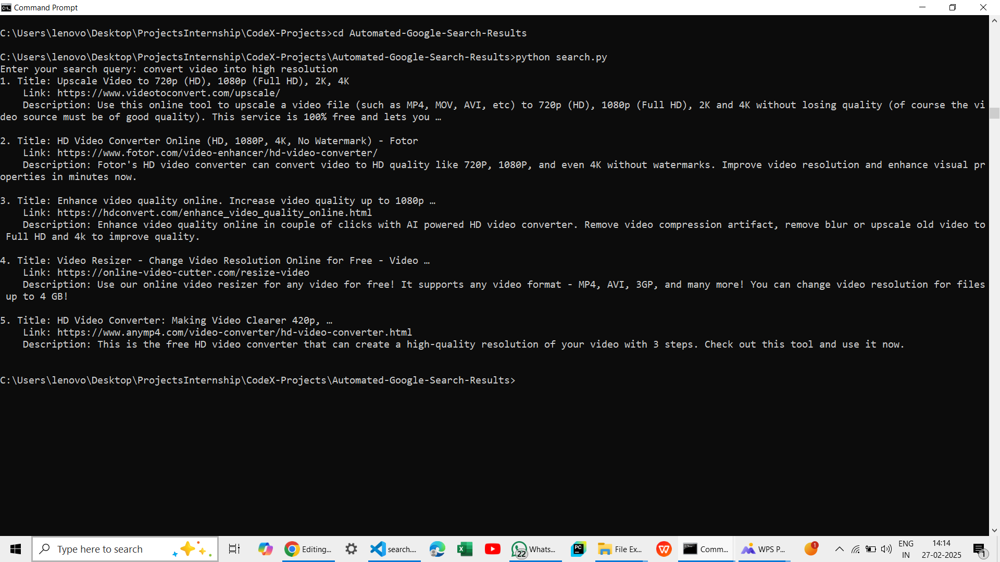

# Automated-Google-Search

This project is a simple **Automated Google Search** application that allows users to fetch the top search results from Google using Python and the **BeautifulSoup** library.

## Features
- Fetch top search results from Google.
- Display search result titles, URLs and description.
- User-friendly interface through command-line.
- Easy-to-use and lightweight.

## Tech Stack
- Python
- BeautifulSoup (for web scraping)
- Requests (for HTTP requests)

## Project Structure
```
├── app.py                # Main Python Application
├── output-img            # Output Screenshot
└── README.md             # Documentation
```

## Installation and Setup
1. Clone the repository:
   ``` bash
   git clone https://github.com/yourusername/Automated-Google-Search.git
   ```

2. Install dependencies:
  ``` bash
   pip install beautifulsoup requests
  ```

3. Run the application:
  ``` bash
   python app.py
  ```

## How It Works
1. The user enters a search query.
2. The application sends a request to Google search.
3. It scrapes the search result titles and URLs using **BeautifulSoup**.
4. The results are displayed on the console.

## Screenshot


## Author
- Priyanka Balla
- ballapriyanka13@gmail.com
- https://github.com/TechByPriyanka

## License
This project is licensed under the **MIT License**.
